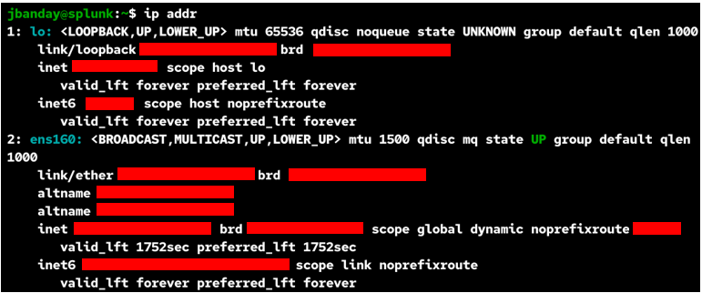
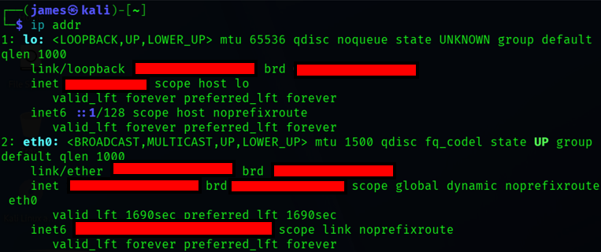

# 🚀 Enterprise Threat Hunting Platform Deployment Guide

---

## 📖 Overview

This deployment guide explains how to build, configure, deploy, and validate the Advanced Enterprise Threat Hunting and Malware Analysis Platform using VMware Workstation Pro, Windows 11 Enterprise, Red Hat Enterprise Linux (RHEL 10.2), Splunk Enterprise, Sysmon, Splunk Universal Forwarder, Suricata IDS, NGINX, Cloudflare SSL, VS Code, and WSL.

The environment simulates a real-world enterprise Security Operations Center (SOC) used for malware analysis, threat hunting, detection engineering, SIEM monitoring, and incident response investigations.

The deployment focuses on safely executing malware inside an isolated VMware Host-Only environment while collecting telemetry and monitoring malicious activity through Splunk Enterprise dashboards and Suricata IDS alerts.

---

## 🏗️ Deployment Architecture

### 🖼️ Enterprise Threat Hunting Architecture


### Figure 1

Enterprise VMware Host-Only Threat Hunting Lab architecture showing Windows 11 telemetry collection, Splunk Enterprise SIEM, Suricata IDS monitoring, Cloudflare HTTPS access, and SOC dashboard visibility.

### References

AWS Pricing Calculator User Guide: This guide provides detailed instructions on using the AWS Pricing Calculator to estimate costs for different AWS services.

---

## 🧬 TrickBot Malware Execution Workflow

### 🖼️ TrickBot Malware Execution Flow


### Figure 2

TrickBot malware execution workflow showing process creation, persistence activity, Sysmon telemetry collection, Splunk log forwarding, and SOC threat detection workflows.

### References

AWS Pricing Calculator User Guide: This guide provides detailed instructions on using the AWS Pricing Calculator to estimate costs for different AWS services.

---

## 🧱 Deployment Components

| Component | Purpose |
|---|---|
| VMware Workstation Pro | Virtualization platform |
| Windows 11 Enterprise | Malware analysis endpoint |
| RHEL 10.2 | Splunk Enterprise SIEM server |
| Splunk Enterprise | Security monitoring platform |
| Sysmon | Endpoint telemetry collection |
| Splunk Universal Forwarder | Log forwarding |
| Suricata IDS | Network intrusion detection |
| NGINX | Reverse proxy |
| Cloudflare SSL | HTTPS encryption |
| VS Code | Configuration and documentation |
| WSL | Linux development environment |
| Wireshark | Packet capture analysis |
| YARA | Malware signature detection |

---

## 🌐 VMware Host-Only Network Configuration

### Network Overview

The deployment uses VMware Host-Only networking to isolate malware activity from the public internet while allowing secure communication between the virtual machines.

### Network Configuration

| Setting | Value |
|---|---|
| Network Type | Host-Only |
| Subnet | 192.168.159.0/24 |
| Gateway | 192.168.159.2 |
| DHCP Server | 192.168.159.254 |

---

## 🖥️ Windows 11 Enterprise Deployment

### Purpose

The Windows 11 Enterprise VM acts as the malware execution endpoint and telemetry source.

### Recommended VM Configuration

| Setting | Value |
|---|---|
| CPU | 4 vCPUs |
| Memory | 8 GB RAM |
| Disk | 100 GB |
| Network Adapter | Host-Only |
| Hostname | Enterprise-Threat-Hunting |

---

### 🖼️ Windows Enterprise Network Configuration


### Figure 3

Windows 11 Enterprise endpoint network configuration used for Sysmon telemetry and Splunk log forwarding.

### References

AWS Pricing Calculator User Guide: This guide provides detailed instructions on using the AWS Pricing Calculator to estimate costs for different AWS services.

---

## 🐧 RHEL 10.2 SIEM Deployment

### Purpose

The RHEL 10.2 VM hosts Splunk Enterprise, Suricata IDS, and enterprise monitoring services.

### Recommended VM Configuration

| Setting | Value |
|---|---|
| CPU | 4 vCPUs |
| Memory | 8 GB RAM |
| Disk | 100 GB |
| Network Adapter | Host-Only |
| Hostname | splunk.caremedix.net |

---

### 🖼️ RHEL Enterprise Network Configuration



### Figure 4

RHEL 10.2 enterprise SIEM server network configuration hosting Splunk Enterprise and Suricata IDS.

### References

AWS Pricing Calculator User Guide: This guide provides detailed instructions on using the AWS Pricing Calculator to estimate costs for different AWS services.

---

## 🐉 Kali Linux Analyst VM Deployment

### Purpose

The Kali Linux VM acts as the analyst workstation used for SOC investigations, validation testing, and threat hunting.

### Recommended VM Configuration

| Setting | Value |
|---|---|
| CPU | 2 vCPUs |
| Memory | 4 GB RAM |
| Disk | 60 GB |
| Network Adapter | Host-Only |
| Hostname | kali |

---

### 🖼️ Kali Enterprise Network Configuration



### Figure 5

Kali Linux analyst workstation configuration used for enterprise threat hunting, validation testing, and SOC investigations.

### References

AWS Pricing Calculator User Guide: This guide provides detailed instructions on using the AWS Pricing Calculator to estimate costs for different AWS services.

---

## 💻 Install VS Code

### Command Overview

### Command

```bash
code .
```

---

### Explanation

- `code`: Opens Visual Studio Code.
- `.`: Opens the current project folder.

---

### Summary

This opens the enterprise threat hunting project inside VS Code.

---

## 🐧 Install WSL

### Command Overview

### Command

```powershell
wsl --install
```

---

### Explanation

- `wsl`: Windows Subsystem for Linux.
- `--install`: Installs WSL and Ubuntu.

---

### Summary

This installs the Linux development environment used inside VS Code.

---

## 📊 Install Splunk Enterprise

### Command Overview

### Command

```bash
sudo rpm -ivh splunk-*.rpm
```

---

### Explanation

- `sudo`: Runs as administrator.
- `rpm -ivh`: Installs RPM packages.
- `splunk-*.rpm`: Splunk Enterprise installer.

---

### Summary

This installs Splunk Enterprise on the RHEL SIEM server.

---

## ▶️ Start Splunk Enterprise

### Command Overview

### Command

```bash
sudo /opt/splunk/bin/splunk start --accept-license --answer-yes --no-prompt --run-as-root
```

---

### Explanation

- `sudo`: Runs as administrator.
- `start`: Starts Splunk services.
- `--accept-license`: Accepts Splunk license agreement.
- `--answer-yes`: Automatically confirms prompts.
- `--no-prompt`: Disables interactive prompts.
- `--run-as-root`: Runs Splunk using root privileges.

---

### Summary

This starts Splunk Enterprise services on the RHEL SIEM server.

---

## 🖥️ Install Sysmon

### Command Overview

### Command

```powershell
sysmon64.exe -accepteula -i sysmonconfig-export.xml
```

---

### Explanation

- `sysmon64.exe`: Sysmon installer.
- `-accepteula`: Accepts Sysmon license.
- `-i`: Installs Sysmon configuration.
- `sysmonconfig-export.xml`: Sysmon configuration file.

---

### Summary

This installs Sysmon endpoint telemetry collection.

---

## 📡 Configure Splunk Universal Forwarder

### Purpose

The Splunk Universal Forwarder securely forwards endpoint telemetry into Splunk Enterprise.

### Forwarded Logs

- Windows Security Logs
- Windows System Logs
- Windows Application Logs
- Sysmon Operational Logs

---

### Example inputs.conf

```ini
[WinEventLog://Application]
disabled = 0
index = windows

[WinEventLog://Security]
disabled = 0
index = windows

[WinEventLog://System]
disabled = 0
index = windows

[WinEventLog://Microsoft-Windows-Sysmon/Operational]
disabled = 0
renderXml = true
index = sysmon
```

---

## 🛡️ Install Suricata IDS

### Command Overview

### Command

```bash
sudo dnf install suricata -y
```

---

### Explanation

- `sudo`: Runs as administrator.
- `dnf install`: Installs packages.
- `suricata`: IDS platform.
- `-y`: Automatically confirms installation.

---

### Summary

This installs Suricata IDS monitoring on the RHEL SIEM server.

---

## ▶️ Start Suricata IDS

### Command Overview

### Command

```bash
sudo systemctl enable --now suricata
```

---

### Explanation

- `systemctl`: Linux service manager.
- `enable`: Starts service during boot.
- `--now`: Starts service immediately.
- `suricata`: IDS monitoring service.

---

### Summary

This starts Suricata IDS monitoring services.

---

## 🔐 Configure NGINX Reverse Proxy

### Purpose

NGINX provides secure HTTPS access to Splunk Enterprise.

### Traffic Flow

```text
HTTPS 443 → NGINX → Splunk Web 8000
```

---

## ☁️ Configure Cloudflare SSL

### Purpose

Cloudflare provides DNS management and HTTPS encryption for secure Splunk web access.

### Example Configuration

| Setting | Value |
|---|---|
| Domain | splunk.caremedix.net |
| IP Address | 192.168.159.129 |
| SSL Mode | Full (Strict) |

---

## 🔍 Verify Sysmon Events

### Command Overview

### Command

```powershell
Get-WinEvent -LogName "Microsoft-Windows-Sysmon/Operational"
```

---

### Explanation

- `Get-WinEvent`: Reads Windows Event Logs.
- `-LogName`: Specifies log source.
- `Sysmon/Operational`: Sysmon telemetry logs.

---

### Summary

This verifies that Sysmon telemetry collection is operational.

---

## 📊 Verify Splunk Data Ingestion

### Example Splunk Query

```spl
index=*
| stats count by sourcetype
```

---

### Purpose

- Verifies log forwarding
- Confirms SIEM ingestion
- Validates telemetry collection

---

## 🧪 Malware Analysis Workflow

### Workflow Steps

1. Download malware samples from MalwareBazaar
2. Transfer samples into isolated VM
3. Execute malware safely
4. Collect Sysmon telemetry
5. Forward logs into Splunk
6. Monitor Suricata IDS alerts
7. Investigate process behavior
8. Analyze PowerShell activity
9. Correlate detections with MITRE ATT&CK
10. Validate incident response workflow
11. Restore clean VM snapshot

---

## 📊 Splunk Dashboard Validation

### 🖼️ Enterprise Threat Hunting Dashboard 01


### Figure 6

Splunk Enterprise dashboard displaying authentication events, process monitoring, and enterprise threat hunting telemetry.

### References

AWS Pricing Calculator User Guide: This guide provides detailed instructions on using the AWS Pricing Calculator to estimate costs for different AWS services.

---

### 🖼️ Enterprise Threat Hunting Dashboard 02


### Figure 7

Advanced Splunk dashboard showing MITRE ATT&CK mappings, threat detections, and SOC investigation workflows.

### References

AWS Pricing Calculator User Guide: This guide provides detailed instructions on using the AWS Pricing Calculator to estimate costs for different AWS services.

---

## 🧠 Microsoft Defender Verification

### 🖼️ Microsoft Defender Status Verification


### Figure 8

PowerShell verification of Microsoft Defender operational status and malware protection monitoring.

### References

AWS Pricing Calculator User Guide: This guide provides detailed instructions on using the AWS Pricing Calculator to estimate costs for different AWS services.

---

## 🧾 YARA Detection Rules

### 🖼️ TrickBot YARA Rule


### Figure 9

YARA detection rule used for identifying TrickBot malware artifacts and suspicious indicators.

### References

AWS Pricing Calculator User Guide: This guide provides detailed instructions on using the AWS Pricing Calculator to estimate costs for different AWS services.

---

## 🛠️ Splunk Troubleshooting

### 🖼️ Splunk Troubleshooting Workflow


### Figure 10

Splunk Enterprise troubleshooting workflow showing failed restart attempts, process termination, and successful SIEM recovery procedures.

### References

AWS Pricing Calculator User Guide: This guide provides detailed instructions on using the AWS Pricing Calculator to estimate costs for different AWS services.

---

### Command Overview

### Command

```bash
sudo pkill -f splunk
```

---

### Explanation

- `sudo`: Runs as administrator.
- `pkill`: Terminates processes.
- `-f`: Matches full process names.
- `splunk`: Targets Splunk services.

---

### Summary

This forcefully terminates failed or stuck Splunk processes.

---

### Command Overview

### Command

```bash
sudo /opt/splunk/bin/splunk start --accept-license --answer-yes --no-prompt --run-as-root
```

---

### Explanation

- `start`: Starts Splunk services.
- `--accept-license`: Accepts license agreement.
- `--answer-yes`: Automatically confirms prompts.
- `--no-prompt`: Disables interactive prompts.
- `--run-as-root`: Runs Splunk with root privileges.

---

### Summary

This restarts Splunk Enterprise after terminating failed or stuck processes.

---

## 🔐 Security Best Practices

- Use VMware Host-Only networking
- Never expose malware VMs to the internet
- Use VM snapshots before malware execution
- Never upload live malware samples to GitHub
- Use sanitized screenshots only
- Use redacted logs for public repositories
- Store malware hashes instead of binaries
- Restrict analyst workstation access

---

## 📁 Recommended Screenshot Collection

- VMware Configuration
- Windows Enterprise Setup
- RHEL SIEM Configuration
- Kali Analyst VM
- Splunk Dashboards
- Sysmon Logs
- Malware Execution
- YARA Rules
- Suricata IDS Alerts
- Incident Response Workflow

---

## 🧠 Key Learning Outcomes

- Built enterprise SIEM architecture
- Configured Splunk Enterprise monitoring
- Implemented Sysmon telemetry collection
- Integrated Suricata IDS monitoring
- Performed malware analysis safely
- Implemented MITRE ATT&CK mapping
- Practiced SOC investigation workflows
- Developed detection engineering workflows
- Investigated malicious process activity
- Validated incident response procedures

---

## ⚠️ Security Notice

This environment is intended for educational cybersecurity research and malware analysis purposes only.

### 🚫 Do NOT Upload

- Live malware samples
- Credentials
- Private keys
- Sensitive logs
- API keys
- VM memory dumps

### ✅ Safe Uploads

- Sanitized screenshots
- Redacted logs
- YARA rules
- Detection queries
- Architecture diagrams
- Threat hunting reports

---

## 📚 References

### 🖥️ VMware Workstation Pro

https://docs.vmware.com/en/VMware-Workstation-Pro/index.html

---

### 📊 Splunk Enterprise

https://docs.splunk.com/Documentation/Splunk

---

### 🖥️ Sysmon

https://learn.microsoft.com/en-us/sysinternals/downloads/sysmon

---

### 🛡️ Suricata

https://docs.suricata.io/

---

### 🎯 MITRE ATT&CK

https://attack.mitre.org/

---

## 👨‍💻 Author

James Banday

- LinkedIn: https://www.linkedin.com/in/james-allen-morta-banday-62a391128/
- GitHub: https://github.com/jbanday808
- Medium: https://medium.com/@jamesbanday

---

## 📄 License

This project is intended for educational, cybersecurity research, and threat hunting training purposes only.

---