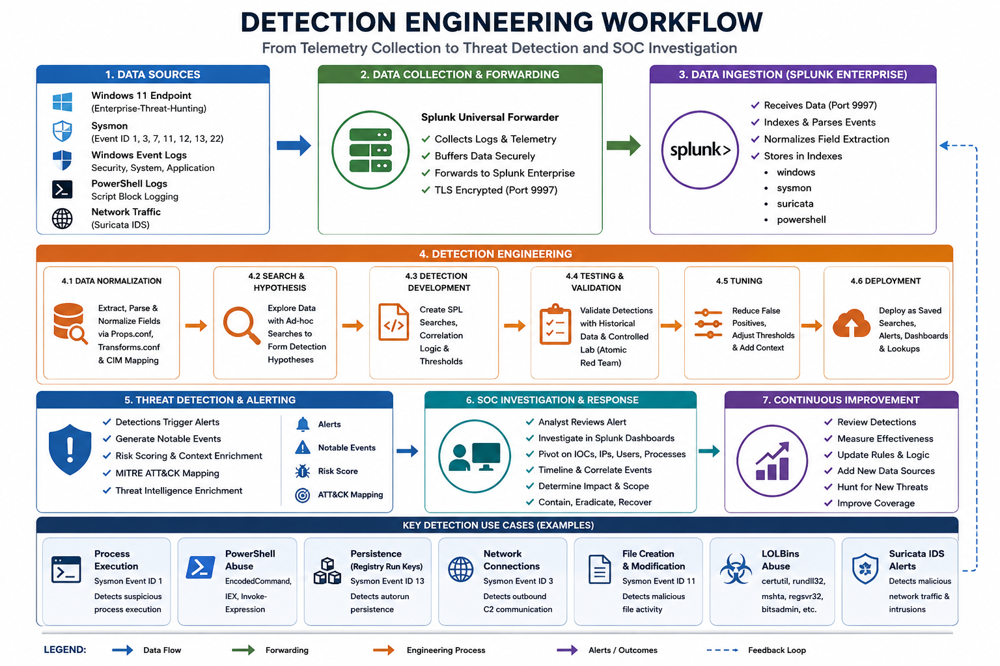

# 🛡️ Detection Engineering

---

## 📖 Overview

This document explains the detection engineering process used in the Enterprise Threat Hunting Platform.

The platform uses:

- Splunk Enterprise
- Sysmon
- Windows Event Logs
- MITRE ATT&CK
- YARA
- Threat hunting queries
- Detection-as-Code methodologies

to identify suspicious activity, malware execution, persistence mechanisms, LOLBins abuse, attacker behavior, and command-and-control communications.

The environment simulates real-world enterprise SOC detection engineering workflows used by cybersecurity analysts, threat hunters, and incident responders.

---

## 🎯 Detection Engineering Goals

---

The detection engineering workflow focuses on:

- Identifying malicious behavior
- Detecting malware execution
- Monitoring persistence activity
- Detecting PowerShell abuse
- Monitoring LOLBins activity
- Correlating Sysmon telemetry
- Detecting command-and-control traffic
- Mapping attacks to MITRE ATT&CK
- Building enterprise SIEM detections
- Supporting SOC investigations

---

## 🏗️ Detection Architecture

---

### 🖼️ Detection Engineering Workflow



**Figure 1:** Enterprise detection engineering workflow showing telemetry collection, Splunk data ingestion, detection development, threat alerting, SOC investigation, and continuous security monitoring improvement.

---

## 📡 Detection Workflow Pipeline

---

```text
Windows Endpoint
        ↓
Sysmon + Windows Event Logs
        ↓
Splunk Universal Forwarder
        ↓
Splunk Enterprise SIEM
        ↓
Detection Rules + Correlation Searches
        ↓
Threat Hunting Dashboards
        ↓
SOC Investigation
        ↓
Incident Response
```

---

## 📡 Data Sources

---

| Data Source | Purpose |
|---|---|
| Sysmon | Endpoint telemetry |
| Windows Security Logs | Authentication monitoring |
| Windows System Logs | System activity |
| Windows Application Logs | Application monitoring |
| PowerShell Logs | Script execution monitoring |
| Suricata IDS | Network intrusion monitoring |
| Splunk Internal Logs | SIEM health monitoring |
| Threat Intelligence Feeds | IOC correlation |

---

# 🖥️ Sysmon Detection Engineering

---

## 📖 Overview

Sysmon provides advanced endpoint visibility for:

- Process creation
- Network connections
- Registry modifications
- DLL loading
- File creation
- PowerShell execution
- Persistence monitoring
- Malware behavior tracking

---

## 📊 Important Sysmon Event IDs

---

| Event ID | Description |
|---|---|
| 1 | Process Creation |
| 3 | Network Connections |
| 7 | Image Loaded |
| 11 | File Create |
| 12 | Registry Create/Delete |
| 13 | Registry Value Set |
| 22 | DNS Queries |

---

## ⚡ Process Creation Detection

---

### Purpose

Detect suspicious process execution commonly associated with malware and attacker activity.

---

### Splunk Detection Query

```spl
index=sysmon EventCode=1
| table _time host Image CommandLine ParentImage User
| sort -_time
```

---

**Figure 2:** Sysmon process creation detection query used to identify suspicious executable activity and malicious process execution.

---

## 🧠 PowerShell Detection Engineering

---

### Purpose

Detect malicious PowerShell execution and encoded command activity.

---

### Splunk Detection Query

```spl
index=sysmon powershell.exe "*EncodedCommand*"
| table _time host CommandLine User
```

---

**Figure 3:** PowerShell detection query used to identify encoded PowerShell execution and suspicious scripting behavior.

---

## 🔥 LOLBins Detection Engineering

---

### Purpose

Detect Living Off the Land Binaries (LOLBins) abused by attackers to evade security controls.

---

## 📋 Common LOLBins

---

| LOLBin | Purpose |
|---|---|
| certutil.exe | File download abuse |
| rundll32.exe | DLL execution |
| regsvr32.exe | Script execution |
| mshta.exe | HTA malware execution |
| powershell.exe | Script execution |
| bitsadmin.exe | Background transfer abuse |

---

### Splunk Detection Query

```spl
index=sysmon EventCode=1
(Image="*certutil.exe" OR Image="*rundll32.exe" OR Image="*mshta.exe")
| table _time host Image CommandLine ParentImage
```

---

**Figure 4:** LOLBins detection query used to identify suspicious native Windows binary abuse and malware execution techniques.

---

## 🛡️ Registry Persistence Detection

---

### Purpose

Detect malware persistence activity using Windows Registry Run Keys.

---

### Splunk Detection Query

```spl
index=sysmon EventCode=13
| table _time host TargetObject Details Image
```

---

**Figure 5:** Registry persistence detection query used to identify malicious autorun registry modifications and malware persistence mechanisms.

---

## 🌐 Network Connection Detection

---

### Purpose

Detect suspicious outbound connections and command-and-control (C2) communications.

---

### Splunk Detection Query

```spl
index=sysmon EventCode=3
| table _time host Image DestinationIp DestinationPort
```

---

**Figure 6:** Network connection detection query used to identify suspicious outbound malware communications and C2 traffic.

---

## 🛡️ Suricata IDS Detection Engineering

---

## 📖 Overview

Suricata IDS monitors malicious network traffic and intrusion activity across the enterprise malware analysis environment.

---

## 🚨 Detection Capabilities

---

- Command-and-Control Detection
- DNS Tunneling Detection
- Malware Traffic Analysis
- Threat Intelligence Correlation
- Intrusion Detection
- Suspicious HTTP Traffic
- Network Beaconing Detection

---

### Splunk Suricata Query

```spl
index=suricata
| stats count by alert.signature src_ip dest_ip
```

---

**Figure 7:** Suricata IDS detection query used to identify malicious network traffic and intrusion activity.

---

## 🎯 MITRE ATT&CK Mapping

---

## 📖 Overview

MITRE ATT&CK mapping correlates attacker techniques with detection rules and SOC investigations.

---

## 🔍 Example ATT&CK Techniques

---

| Technique ID | Technique |
|---|---|
| T1059.001 | PowerShell |
| T1055 | Process Injection |
| T1547.001 | Registry Run Keys |
| T1218 | Signed Binary Proxy Execution |
| T1105 | Ingress Tool Transfer |
| T1053 | Scheduled Tasks |

---

## 📊 MITRE ATT&CK Workflow

---

```text
Telemetry Collection
        ↓
Detection Rules
        ↓
Correlation Searches
        ↓
Threat Intelligence Matching
        ↓
MITRE ATT&CK Mapping
        ↓
SOC Investigation
```

---

## 🧪 YARA Detection Engineering

---

## 📖 Overview

YARA rules are used to identify malware artifacts, suspicious strings, embedded payloads, and malicious binaries.

---

### 🖼️ TrickBot YARA Rule


**Figure 8:** YARA detection rule used to identify TrickBot malware artifacts and suspicious indicators.

---

## 🧬 Malware Detection Workflow

---

## 📖 Overview

The malware detection workflow combines endpoint telemetry, network monitoring, SIEM correlation, and analyst investigation workflows.

---

## 🔍 Detection Process

---

1. Collect Sysmon telemetry
2. Forward logs into Splunk
3. Normalize event fields
4. Apply detection rules
5. Trigger correlation searches
6. Generate SOC alerts
7. Correlate MITRE ATT&CK techniques
8. Investigate malicious activity
9. Validate malware behavior
10. Contain malicious activity
11. Restore clean VM snapshot

---

## 📊 Splunk Dashboard Detection Validation

---

### 🖼️ Enterprise Threat Hunting Dashboard 01


**Figure 9:** Splunk Enterprise dashboard displaying authentication monitoring, process activity, and enterprise threat hunting telemetry.

---

### 🖼️ Enterprise Threat Hunting Dashboard 02


**Figure 10:** Advanced Splunk dashboard showing MITRE ATT&CK mapping, threat detections, and SOC investigation workflows.

---

## 🚨 Threat Hunting Workflow

---

## 📖 Overview

Threat hunting workflows investigate suspicious endpoint activity using Sysmon telemetry, Splunk dashboards, and Suricata IDS alerts.

---

## 🔍 Threat Hunting Process

---

1. Review Splunk dashboards
2. Investigate suspicious processes
3. Analyze PowerShell activity
4. Review persistence mechanisms
5. Investigate network traffic
6. Validate IDS alerts
7. Correlate MITRE ATT&CK techniques
8. Document findings
9. Contain malicious activity
10. Restore clean VM snapshots

---

## 🛠️ Detection Engineering Best Practices

---

## ✅ Recommended Practices

- Use Sysmon advanced logging
- Normalize Windows event fields
- Map detections to MITRE ATT&CK
- Monitor PowerShell abuse
- Detect LOLBins activity
- Monitor network connections
- Use threat intelligence feeds
- Validate detections continuously
- Tune false positives regularly
- Document all detection logic

---

## 🔐 Security Recommendations

---

### 🚫 Never Upload

- Live malware samples
- Credentials
- API keys
- Private keys
- Sensitive enterprise logs

---

### ✅ Safe Uploads

- Sanitized screenshots
- Redacted logs
- Detection queries
- YARA rules
- Architecture diagrams
- Threat hunting reports

---

## 📚 References

---

## 📊 Splunk Enterprise

https://docs.splunk.com/Documentation/Splunk

---

## 🖥️ Sysmon

https://learn.microsoft.com/en-us/sysinternals/downloads/sysmon

---

## 🛡️ Suricata

https://docs.suricata.io/

---

## 🎯 MITRE ATT&CK

https://attack.mitre.org/

---

## 🧾 YARA

https://yara.readthedocs.io/

---

## 🔥 LOLBAS Project

https://lolbas-project.github.io/

---

## 👨‍💻 Author

James Banday

- LinkedIn: https://www.linkedin.com/in/james-allen-morta-banday-62a391128/
- GitHub: https://github.com/jbanday808](https://github.com/jbanday808/Enterprise-Threat-Hunting/tree/main)

---

## 📄 License

This project is intended for educational, cybersecurity research, and threat hunting training purposes only.

---
