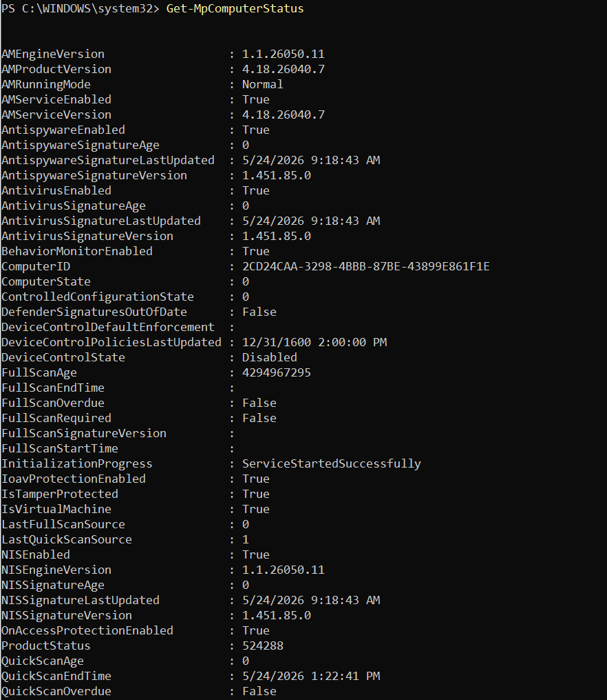

# 🧪 Dynamic Malware Analysis

---

## 📖 Overview

This document explains the dynamic malware analysis process performed inside the Enterprise Threat Hunting Platform.

Dynamic malware analysis safely executes malware samples inside an isolated VMware Host-Only environment while collecting endpoint telemetry, monitoring network activity, detecting persistence mechanisms, and validating enterprise threat detections.

The environment uses:

- VMware Workstation Pro
- Windows 11 Enterprise
- Sysmon
- Splunk Enterprise
- Splunk Universal Forwarder
- Suricata IDS
- Wireshark
- Microsoft Defender
- MITRE ATT&CK
- PowerShell

to simulate real-world enterprise SOC investigations and malware analysis workflows.

---

## 🎯 Dynamic Analysis Goals

---

The dynamic malware analysis workflow focuses on:

- Observing malware behavior
- Monitoring process execution
- Detecting persistence activity
- Investigating PowerShell abuse
- Monitoring registry modifications
- Detecting network connections
- Identifying command-and-control activity
- Validating Splunk detections
- Correlating MITRE ATT&CK techniques
- Supporting SOC investigations

---

## 🏗️ Dynamic Analysis Architecture

---

### 🖼️ Enterprise Threat Hunting Architecture


**Figure 1:** Enterprise VMware Host-Only Threat Hunting Lab architecture showing Windows 11 telemetry collection, Splunk Enterprise SIEM, Suricata IDS monitoring, and SOC investigation workflows.

---

### 🖼️ TrickBot Malware Execution Flow


**Figure 2:** TrickBot malware execution workflow showing process creation, persistence behavior, Sysmon telemetry collection, and Splunk detection monitoring.

---

## 🌐 VMware Host-Only Isolation

---

## 📖 Overview

The malware analysis environment uses VMware Host-Only networking to isolate malware execution from the public internet.

---

## 🔒 Security Benefits

---

- Prevents malware propagation
- Blocks internet exposure
- Protects the analyst workstation
- Supports safe malware execution
- Creates isolated SOC lab environment

---

## 🌐 Network Configuration

---

| Component | IP Address |
|---|---|
| Windows 11 Enterprise | 192.168.159.130 |
| RHEL Splunk Server | 192.168.159.129 |
| Kali Linux Analyst VM | 192.168.159.131 |
| Gateway / DNS | 192.168.159.2 |

---

## 🖥️ Malware Analysis Endpoint

---

## 📖 Windows 11 Enterprise Endpoint

The Windows 11 Enterprise virtual machine acts as the malware execution endpoint and telemetry source.

---

## 📋 Installed Components

---

| Component | Purpose |
|---|---|
| Sysmon | Endpoint telemetry collection |
| Splunk Universal Forwarder | Log forwarding |
| Microsoft Defender | Malware detection |
| PowerShell | Scripting and automation |
| Wireshark | Packet analysis |

---

### 🖼️ Windows Enterprise Network Configuration


**Figure 3:**  Windows 11 Enterprise endpoint network configuration used for Sysmon telemetry and Splunk log forwarding.

### References

AWS Pricing Calculator User Guide: This guide provides detailed instructions on using the AWS Pricing Calculator to estimate costs for different AWS services.

---

## 🧬 Malware Execution Workflow

---

## 📖 Overview

The malware execution workflow monitors the complete malware lifecycle from execution to detection.

---

## 🔍 Execution Process

---

1. Create clean VM snapshot
2. Transfer malware sample into VM
3. Disable external internet access
4. Execute malware safely
5. Monitor Sysmon telemetry
6. Review Splunk detections
7. Analyze PowerShell activity
8. Monitor registry persistence
9. Investigate network traffic
10. Validate Suricata IDS alerts
11. Document malware behavior
12. Restore clean VM snapshot

---

## 🖥️ TrickBot Malware Sample

---

### 🖼️ TrickBot Malware Execution


**Figure 4:** TrickBot malware sample executed inside the isolated Windows 11 Enterprise malware analysis environment.

---

## 📡 Sysmon Telemetry Collection

---

## 📖 Overview

Sysmon provides advanced endpoint telemetry used to monitor malware behavior during execution.

---

## 📊 Important Sysmon Event IDs

---

| Event ID | Description |
|---|---|
| 1 | Process Creation |
| 3 | Network Connections |
| 7 | Image Loaded |
| 11 | File Create |
| 12 | Registry Create/Delete |
| 13 | Registry Value Set |
| 22 | DNS Queries |

---

## ⚡ Process Creation Monitoring

---

### Splunk Detection Query

```spl
index=sysmon EventCode=1
| table _time host Image CommandLine ParentImage User
| sort -_time
```

---

**Figure 5:** Sysmon process creation query used to identify suspicious malware execution and malicious process activity.


---

## 🧠 PowerShell Monitoring

---

### Purpose

Monitor suspicious PowerShell execution and encoded command activity.

---

### Splunk Detection Query

```spl
index=sysmon powershell.exe "*EncodedCommand*"
| table _time host CommandLine User
```

---

**Figure 6:** PowerShell monitoring query used to identify encoded PowerShell execution and malicious scripting activity.

---

## 🛡️ Registry Persistence Monitoring

---

### Purpose

Detect malware persistence mechanisms using Windows Registry Run Keys.

---

### Splunk Detection Query

```spl
index=sysmon EventCode=13
| table _time host TargetObject Details Image
```

---

**Figure 7:** Registry persistence monitoring query used to identify malicious autorun registry modifications.

---

## 🌐 Network Traffic Analysis

---

## 📖 Overview

Network analysis monitors suspicious outbound traffic and possible command-and-control communications.

---

## 📊 Monitoring Capabilities

---

- DNS Queries
- HTTP Requests
- C2 Beaconing
- Suspicious Connections
- Malware Communications
- Threat Intelligence Correlation

---

## 📡 Sysmon Network Connection Query

---

```spl
index=sysmon EventCode=3
| table _time host Image DestinationIp DestinationPort
```

---

**Figure 8:** Network connection query used to identify suspicious outbound malware communications and command-and-control traffic.

---

## 🛡️ Suricata IDS Monitoring

---

## 📖 Overview

Suricata IDS monitors malicious network traffic and intrusion activity generated during malware execution.

---

## 🚨 Detection Capabilities

---

- Command-and-Control Detection
- DNS Tunneling Detection
- Malware Traffic Analysis
- Threat Intelligence Correlation
- Intrusion Detection
- Suspicious HTTP Traffic

---

### Splunk Suricata Query

```spl
index=suricata
| stats count by alert.signature src_ip dest_ip
```

---

**Figure 9:** Suricata IDS query used to identify malicious network traffic and intrusion activity during malware execution.

---

## 📊 Splunk Dashboard Monitoring

---

### 🖼️ Enterprise Threat Hunting Dashboard 01


**Figure 10:** Splunk Enterprise dashboard displaying authentication monitoring, process activity, and enterprise threat hunting telemetry.


---

### 🖼️ Enterprise Threat Hunting Dashboard 02


**Figure 11:** Advanced Splunk dashboard showing MITRE ATT&CK mapping, threat detections, and SOC investigation workflows.

---

## 🎯 MITRE ATT&CK Mapping

---

## 📖 Overview

MITRE ATT&CK mapping correlates malware behavior with attacker techniques and SOC detections.

---

## 🔍 Example ATT&CK Techniques

---

| Technique ID | Technique |
|---|---|
| T1059.001 | PowerShell |
| T1055 | Process Injection |
| T1547.001 | Registry Run Keys |
| T1218 | Signed Binary Proxy Execution |
| T1105 | Ingress Tool Transfer |

---

## 📊 Malware Analysis Workflow

---

```text
Malware Execution
        ↓
Sysmon Telemetry Collection
        ↓
Splunk Log Forwarding
        ↓
Detection Rules
        ↓
Threat Hunting Dashboards
        ↓
SOC Investigation
        ↓
Incident Response
```

---

## 🧠 Microsoft Defender Validation

---

### 🖼️ Microsoft Defender Status Verification



**Figure 12:** PowerShell verification of Microsoft Defender operational status and malware protection monitoring.


---

## 🧪 YARA Malware Detection

---

## 📖 Overview

YARA rules are used to identify malware artifacts and suspicious indicators generated during malware execution.

---

### 🖼️ TrickBot YARA Rule


**Figure 13:** YARA detection rule used to identify TrickBot malware artifacts and suspicious indicators.

---

## 🚨 Incident Response Workflow

---

## 📖 Overview

SOC analysts investigate suspicious activity generated during malware execution.

---

## 🔍 Incident Response Process

---

1. Review Splunk alerts
2. Investigate suspicious processes
3. Analyze PowerShell activity
4. Review persistence mechanisms
5. Investigate network connections
6. Validate IDS alerts
7. Correlate MITRE ATT&CK techniques
8. Document findings
9. Contain malicious activity
10. Restore clean VM snapshot

---

## 🛠️ Dynamic Analysis Best Practices

---

## ✅ Recommended Practices

- Use VMware Host-Only networking
- Create clean VM snapshots
- Monitor Sysmon telemetry continuously
- Validate detections during execution
- Analyze PowerShell activity
- Monitor registry persistence
- Capture network traffic
- Use isolated analyst systems
- Store malware hashes instead of binaries
- Document all findings

---

## 🔐 Security Recommendations

---

### 🚫 Never Upload

- Live malware samples
- Credentials
- Private keys
- API keys
- Sensitive enterprise logs

---

### ✅ Safe Uploads

- Sanitized screenshots
- Redacted logs
- YARA rules
- Detection queries
- Architecture diagrams
- Threat hunting reports

---

## 📚 References

---

## 📊 Splunk Enterprise

https://docs.splunk.com/Documentation/Splunk

---

## 🖥️ Sysmon

https://learn.microsoft.com/en-us/sysinternals/downloads/sysmon

---

## 🛡️ Suricata

https://docs.suricata.io/

---

## 🎯 MITRE ATT&CK

https://attack.mitre.org/

---

## 🧾 YARA

https://yara.readthedocs.io/

---

## 🌐 Wireshark

https://www.wireshark.org/docs/

---

## 👨‍💻 Author

James Banday

- LinkedIn: https://www.linkedin.com/in/james-allen-morta-banday-62a391128/
- GitHub: https://github.com/jbanday808
- Medium: https://medium.com/@jamesbanday

---

## 📄 License

This project is intended for educational, cybersecurity research, and threat hunting training purposes only.

---
