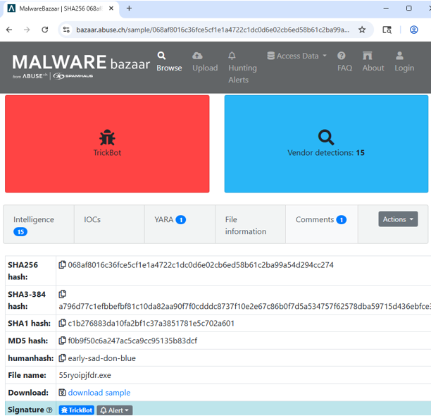
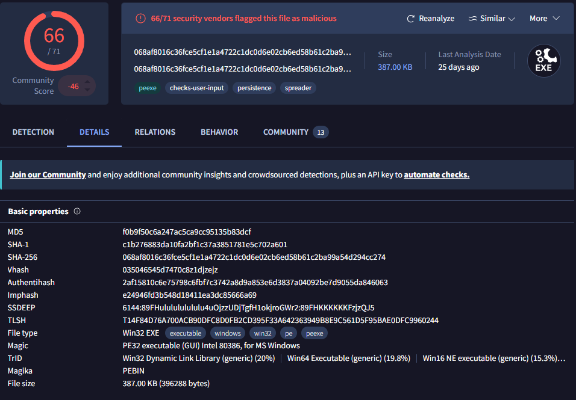
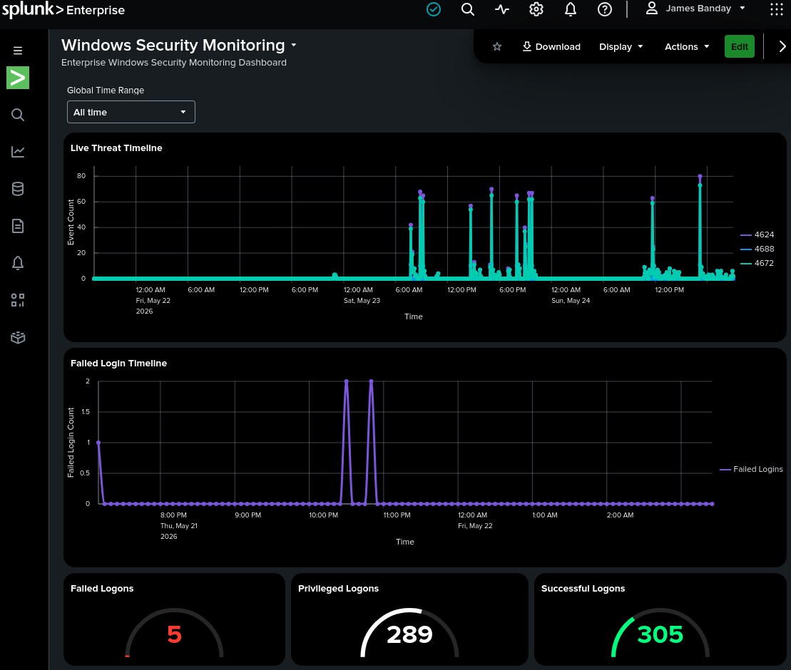
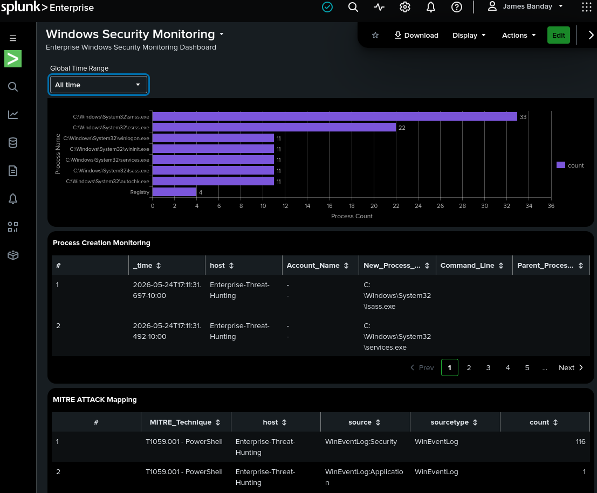
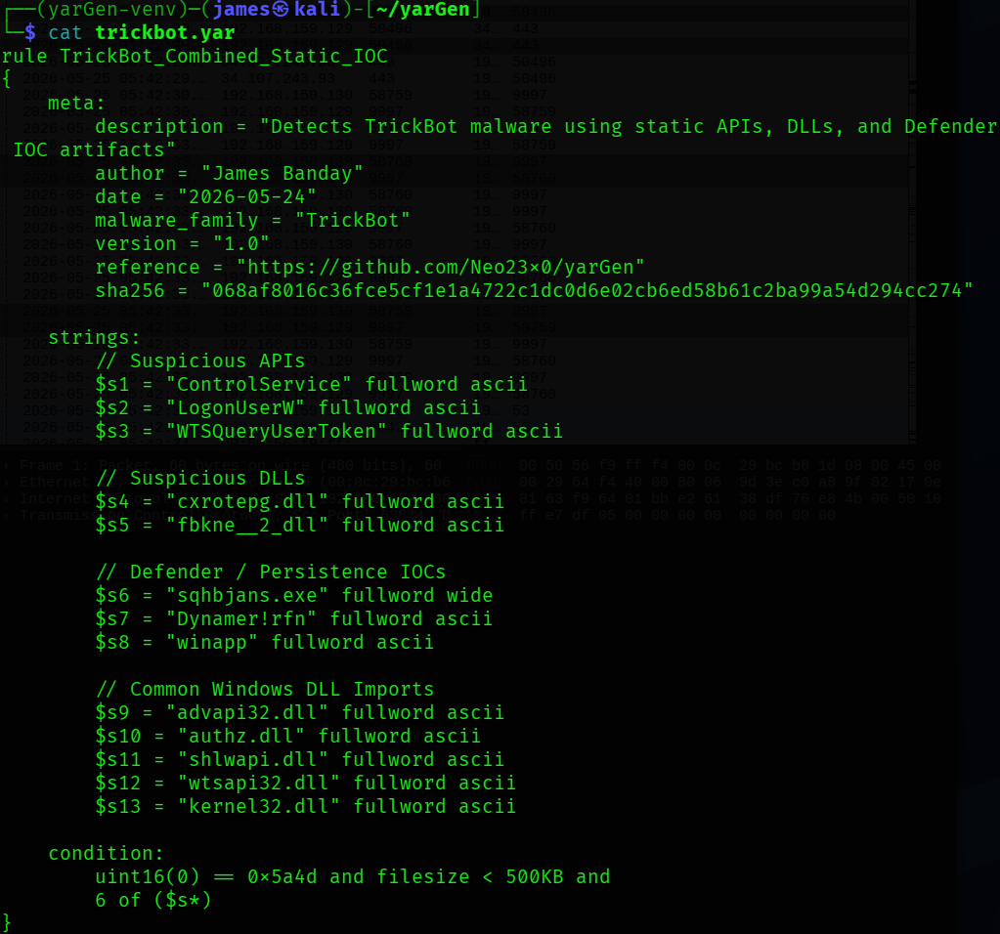

# 🕵️ Forensic Analysis

---

## 📖 Overview

This document explains the forensic analysis process performed inside the Enterprise Threat Hunting Platform.

The forensic investigation focuses on collecting, analyzing, and validating digital evidence generated during malware execution and enterprise threat hunting activities.

The environment uses:

- VMware Workstation Pro
- Windows 11 Enterprise
- Splunk Enterprise
- Sysmon
- Splunk Universal Forwarder
- PowerShell
- Wireshark
- Suricata IDS
- YARA
- VirusTotal
- MalwareBazaar
- MITRE ATT&CK

to simulate real-world SOC investigations, malware triage, incident response, and enterprise forensic workflows.

---

## 🎯 Forensic Analysis Goals

---

The forensic investigation workflow focuses on:

- Identifying malware artifacts
- Investigating suspicious processes
- Collecting endpoint telemetry
- Detecting persistence mechanisms
- Investigating network activity
- Correlating threat intelligence
- Mapping attacker techniques
- Supporting SOC investigations
- Preserving digital evidence
- Validating enterprise detections

---

## 🏗️ Forensic Analysis Architecture

---

### 🖼️ Enterprise Threat Hunting Architecture


### Figure 1

Enterprise VMware Host-Only Threat Hunting Lab architecture showing endpoint telemetry collection, Splunk SIEM monitoring, Suricata IDS analysis, and SOC forensic investigation workflows.

### References

AWS Pricing Calculator User Guide: This guide provides detailed instructions on using the AWS Pricing Calculator to estimate costs for different AWS services.

---

### 🖼️ TrickBot Malware Execution Flow


### Figure 2

TrickBot malware execution workflow showing malware execution, persistence behavior, telemetry generation, and enterprise forensic investigation processes.

### References

AWS Pricing Calculator User Guide: This guide provides detailed instructions on using the AWS Pricing Calculator to estimate costs for different AWS services.

---

## 🌐 VMware Host-Only Isolation

---

## 📖 Overview

The malware analysis environment uses VMware Host-Only networking to isolate forensic investigations from the public internet.

---

## 🔒 Security Benefits

---

- Prevents malware propagation
- Supports safe forensic analysis
- Isolates malicious traffic
- Protects analyst systems
- Enables controlled investigations

---

## 🌐 Network Configuration

---

| Component | IP Address |
|---|---|
| Windows 11 Enterprise | 192.168.159.130 |
| RHEL Splunk Server | 192.168.159.129 |
| Kali Linux Analyst VM | 192.168.159.131 |
| Gateway / DNS | 192.168.159.2 |

---

## 🧬 Malware Evidence Collection

---

## 📖 Overview

Digital evidence collection captures malware artifacts, endpoint telemetry, network activity, and persistence mechanisms generated during malware execution.

---

## 🔍 Evidence Sources

---

| Evidence Source | Purpose |
|---|---|
| Sysmon Logs | Endpoint telemetry |
| Windows Event Logs | Authentication and system activity |
| Splunk SIEM | Centralized log analysis |
| PowerShell Logs | Script execution monitoring |
| Suricata IDS | Network intrusion monitoring |
| Wireshark | Packet capture analysis |
| Malware Samples | Malware artifact analysis |
| YARA Rules | Malware identification |

---

## 🖥️ Malware Sample Investigation

---

### 🖼️ TrickBot Malware Sample


### Figure 3

Suspicious TrickBot malware sample identified during forensic investigation and enterprise threat hunting analysis.

### References

AWS Pricing Calculator User Guide: This guide provides detailed instructions on using the AWS Pricing Calculator to estimate costs for different AWS services.

---

## 🔍 File Hash Investigation

---

## 📖 Overview

Hash analysis validates malware fingerprints and correlates threat intelligence indicators.

---

## ⚡ Generate Malware Hash

---

### Command Overview

### Command

```powershell
Get-FileHash .\sqhbjans.exe -Algorithm SHA256
```

---

### Explanation

- `Get-FileHash`: Generates file hashes.
- `.\sqhbjans.exe`: Malware sample.
- `-Algorithm SHA256`: Uses SHA256 hashing.

---

### Summary

This generates the SHA256 hash used for forensic validation and threat intelligence correlation.

---

## ☁️ MalwareBazaar Threat Intelligence

---

## 📖 Overview

MalwareBazaar provides malware reputation analysis, malware family classification, and threat intelligence metadata.

---

### 🖼️ MalwareBazaar Threat Intelligence



### Figure 4

MalwareBazaar intelligence analysis showing TrickBot malware classification, malware hashes, and detection metadata.

### References

AWS Pricing Calculator User Guide: This guide provides detailed instructions on using the AWS Pricing Calculator to estimate costs for different AWS services.

---

## 🌐 VirusTotal Threat Intelligence

---

## 📖 Overview

VirusTotal validates malware reputation and correlates known malicious indicators.

---

### 🖼️ VirusTotal Threat Intelligence



### Figure 5

VirusTotal malware intelligence analysis showing antivirus detections, suspicious indicators, and malware reputation associated with the TrickBot sample.

### References

AWS Pricing Calculator User Guide: This guide provides detailed instructions on using the AWS Pricing Calculator to estimate costs for different AWS services.

---

## 📡 Sysmon Telemetry Investigation

---

## 📖 Overview

Sysmon telemetry provides advanced forensic visibility into malware execution and endpoint activity.

---

## 📊 Important Sysmon Event IDs

---

| Event ID | Description |
|---|---|
| 1 | Process Creation |
| 3 | Network Connections |
| 7 | Image Loaded |
| 11 | File Create |
| 12 | Registry Create/Delete |
| 13 | Registry Value Set |
| 22 | DNS Queries |

---

## ⚡ Process Creation Investigation

---

### Splunk Detection Query

```spl
index=sysmon EventCode=1
| table _time host Image CommandLine ParentImage User
| sort -_time
```

---

### Figure 6

Sysmon forensic query used to investigate suspicious process creation and malware execution activity.

### References

AWS Pricing Calculator User Guide: This guide provides detailed instructions on using the AWS Pricing Calculator to estimate costs for different AWS services.

---

## 🧠 PowerShell Investigation

---

## 📖 Overview

PowerShell logs are analyzed to identify encoded commands and malicious script execution.

---

### Splunk Detection Query

```spl
index=sysmon powershell.exe "*EncodedCommand*"
| table _time host CommandLine User
```

---

### Figure 7

PowerShell forensic query used to investigate encoded PowerShell execution and suspicious scripting behavior.

### References

AWS Pricing Calculator User Guide: This guide provides detailed instructions on using the AWS Pricing Calculator to estimate costs for different AWS services.

---

## 🛡️ Persistence Investigation

---

## 📖 Overview

Registry analysis identifies malware persistence mechanisms used to survive system reboots.

---

### Splunk Registry Query

```spl
index=sysmon EventCode=13
| table _time host TargetObject Details Image
```

---

### Figure 8

Registry forensic query used to identify malicious persistence mechanisms and autorun registry modifications.

### References

AWS Pricing Calculator User Guide: This guide provides detailed instructions on using the AWS Pricing Calculator to estimate costs for different AWS services.

---

## 🌐 Network Forensic Investigation

---

## 📖 Overview

Network analysis investigates suspicious outbound traffic and possible command-and-control communications.

---

## 📡 Network Connection Query

---

```spl
index=sysmon EventCode=3
| table _time host Image DestinationIp DestinationPort
```

---

### Figure 9

Network forensic query used to identify suspicious outbound malware communications and C2 activity.

### References

AWS Pricing Calculator User Guide: This guide provides detailed instructions on using the AWS Pricing Calculator to estimate costs for different AWS services.

---

## 📊 Splunk Detection Investigation

---

## 📖 Overview

Splunk Enterprise dashboards and detections validate malware activity observed during forensic investigations.

---

### 🖼️ Splunk Malware Detection Results


### Figure 10

Splunk Enterprise malware detections identifying TrickBot activity, suspicious executable paths, and Windows Defender malware alerts.

### References

AWS Pricing Calculator User Guide: This guide provides detailed instructions on using the AWS Pricing Calculator to estimate costs for different AWS services.

---

### 🖼️ Enterprise Threat Hunting Dashboard 01



### Figure 11

Splunk Enterprise dashboard displaying endpoint telemetry, authentication monitoring, and enterprise forensic investigation workflows.

### References

AWS Pricing Calculator User Guide: This guide provides detailed instructions on using the AWS Pricing Calculator to estimate costs for different AWS services.

---

### 🖼️ Enterprise Threat Hunting Dashboard 02



### Figure 12

Advanced Splunk dashboard showing MITRE ATT&CK mapping, threat detections, and SOC investigation workflows.

### References

AWS Pricing Calculator User Guide: This guide provides detailed instructions on using the AWS Pricing Calculator to estimate costs for different AWS services.

---

## 🛡️ Suricata IDS Investigation

---

## 📖 Overview

Suricata IDS monitors malicious network traffic and intrusion activity generated during malware execution.

---

## 🚨 Detection Capabilities

---

- Malware traffic detection
- Command-and-control monitoring
- DNS tunneling detection
- Intrusion detection
- Suspicious HTTP activity
- Threat intelligence correlation

---

### Splunk Suricata Query

```spl
index=suricata
| stats count by alert.signature src_ip dest_ip
```

---

### Figure 13

Suricata IDS forensic query used to identify malicious network traffic and intrusion activity.

### References

AWS Pricing Calculator User Guide: This guide provides detailed instructions on using the AWS Pricing Calculator to estimate costs for different AWS services.

---

## 🎯 MITRE ATT&CK Mapping

---

## 📖 Overview

MITRE ATT&CK mapping correlates observed malware behavior with attacker techniques and enterprise detections.

---

## 🔍 Example ATT&CK Techniques

---

| Technique ID | Technique |
|---|---|
| T1059.001 | PowerShell |
| T1547.001 | Registry Run Keys |
| T1218 | Signed Binary Proxy Execution |
| T1105 | Ingress Tool Transfer |
| T1055 | Process Injection |

---

## 📊 Forensic Investigation Workflow

---

```text
Malware Execution
        ↓
Evidence Collection
        ↓
Sysmon Telemetry Analysis
        ↓
Threat Intelligence Correlation
        ↓
Splunk Detection Validation
        ↓
MITRE ATT&CK Mapping
        ↓
SOC Investigation
        ↓
Incident Response
```

---

## 🧪 YARA Malware Identification

---

## 📖 Overview

YARA rules identify malware artifacts and suspicious indicators observed during forensic analysis.

---

### 🖼️ TrickBot YARA Rule



### Figure 14

YARA malware detection rule used to identify TrickBot artifacts and suspicious malware indicators.

### References

AWS Pricing Calculator User Guide: This guide provides detailed instructions on using the AWS Pricing Calculator to estimate costs for different AWS services.

---

## 🚨 Incident Response Workflow

---

## 📖 Overview

SOC analysts investigate suspicious malware activity using telemetry, threat intelligence, and SIEM detections.

---

## 🔍 Investigation Process

---

1. Identify suspicious activity
2. Collect endpoint telemetry
3. Validate malware indicators
4. Investigate persistence activity
5. Analyze network traffic
6. Correlate threat intelligence
7. Review Splunk detections
8. Map ATT&CK techniques
9. Document findings
10. Restore clean VM snapshot

---

## 🛠️ Forensic Analysis Best Practices

---

## ✅ Recommended Practices

- Use isolated VMware environments
- Preserve digital evidence
- Validate malware hashes
- Monitor Sysmon telemetry
- Correlate multiple evidence sources
- Review PowerShell activity
- Investigate persistence mechanisms
- Monitor network activity
- Validate SIEM detections
- Document all findings

---

## 🔐 Security Recommendations

---

### 🚫 Never Upload

- Live malware samples
- Credentials
- API keys
- Private keys
- Sensitive enterprise logs

---

### ✅ Safe Uploads

- Sanitized screenshots
- Redacted logs
- YARA rules
- Detection queries
- Architecture diagrams
- Threat hunting reports
- Malware hashes

---

## 📚 References

---

## 📊 Splunk Enterprise

https://docs.splunk.com/Documentation/Splunk

---

## 🖥️ Sysmon

https://learn.microsoft.com/en-us/sysinternals/downloads/sysmon

---

## 🛡️ Suricata

https://docs.suricata.io/

---

## 🎯 MITRE ATT&CK

https://attack.mitre.org/

---

## 🧾 YARA

https://yara.readthedocs.io/

---

## 📊 VirusTotal

https://docs.virustotal.com/

---

## ☁️ MalwareBazaar

https://bazaar.abuse.ch/

---

## 🌐 Wireshark

https://www.wireshark.org/docs/

---

## 👨‍💻 Author

James Banday

- LinkedIn: https://www.linkedin.com/in/james-allen-morta-banday-62a391128/
- GitHub: https://github.com/jbanday808
- Medium: https://medium.com/@jamesbanday

---

## 📄 License

This project is intended for educational, cybersecurity research, and threat hunting training purposes only.

---
