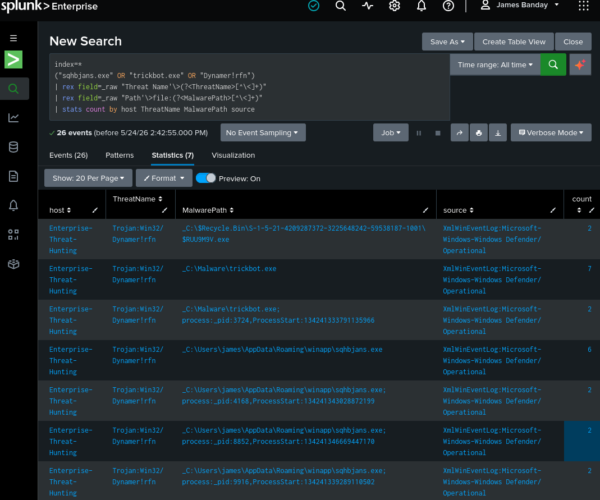

# 🛡️ Mitigations and Security Recommendations

---

# 📖 Overview

---

This document explains the mitigation strategies, containment procedures, remediation actions, and enterprise security recommendations identified during the Enterprise Threat Hunting Platform investigation.

The mitigation process focused on:

- Malware containment
- Endpoint remediation
- Threat detection improvements
- SIEM monitoring enhancements
- Threat hunting improvements
- Detection engineering optimization
- Enterprise security hardening

The environment used:

- VMware Workstation Pro
- Windows 11 Enterprise
- RHEL 10.2
- Splunk Enterprise
- Sysmon
- Splunk Universal Forwarder
- Microsoft Defender
- Suricata IDS
- PowerShell
- YARA
- VirusTotal
- MalwareBazaar
- MITRE ATT&CK

to simulate real-world enterprise incident response and security operations workflows.

---

# 🎯 Security Objectives

---

## ✅ Primary Goals

- Contain malware activity
- Prevent malware persistence
- Improve endpoint visibility
- Enhance SIEM detections
- Improve threat hunting capabilities
- Reduce attack surface
- Improve incident response readiness
- Strengthen enterprise monitoring

---

# 🏗️ Enterprise Threat Hunting Architecture

---

## 🖼️ Enterprise Threat Hunting Architecture


**Figure 1:** Enterprise VMware Host-Only Threat Hunting Lab architecture showing endpoint telemetry collection, Splunk SIEM monitoring, malware analysis workflows, and enterprise SOC visibility.

---

## 🖼️ TrickBot Malware Execution Flow


**Figure 2:** TrickBot malware execution workflow showing malware behavior, persistence activity, telemetry collection, and incident response workflows.

---

# 🚨 Identified Security Risks

---

## 📖 Overview

The investigation identified several security risks associated with malware execution and enterprise endpoint compromise.

---

## ⚠️ Key Security Risks

| Risk | Description |
|---|---|
| Malware Execution | Unauthorized executable activity |
| Registry Persistence | Malware autorun mechanisms |
| Command-and-Control Traffic | Outbound suspicious connections |
| PowerShell Abuse | Suspicious scripting activity |
| Endpoint Compromise | Malware execution on Windows endpoint |
| Threat Propagation | Potential malware spread |
| Suspicious File Creation | Malicious roaming directory artifacts |

---

# 🧬 Malware Containment Actions

---

## 📖 Overview

Immediate containment procedures were performed to isolate the malware and prevent further execution.

---

## ✅ Containment Actions Performed

- Isolated VMware Host-Only environment
- Disabled external internet access
- Preserved forensic evidence
- Stopped suspicious processes
- Removed malicious executable
- Restored clean VMware snapshot
- Validated endpoint cleanup
- Verified Defender protection status

---

## 🖼️ Splunk Malware Detection Dashboard



**Figure 3:** Splunk Enterprise SIEM dashboard identifying suspicious malware activity, malicious executable paths, and Microsoft Defender malware detections.

---

# 🖥️ Endpoint Security Mitigations

---

# 🛡️ Microsoft Defender Protection

---

## 📖 Overview

Microsoft Defender was used to validate malware detection and endpoint remediation procedures.

---

## ✅ Recommended Improvements

- Enable real-time protection
- Enable cloud-delivered protection
- Enable tamper protection
- Enable automatic sample submission
- Enable ransomware protection
- Enable periodic scanning

---

## ⚡ PowerShell Validation Command

### Command Overview

### Command

```powershell
Get-MpComputerStatus
```

---

### Explanation

- `Get-MpComputerStatus`: Displays Microsoft Defender protection status.

---

### Summary

This command validates Microsoft Defender operational status and endpoint protection settings.

---

## 🖼️ Microsoft Defender Status Verification


**Figure 4:** PowerShell verification of Microsoft Defender operational status and malware protection monitoring.


---

# 📡 Sysmon Security Improvements

---

## 📖 Overview

Sysmon significantly improved endpoint visibility and malware telemetry collection.

---

## ✅ Recommended Sysmon Enhancements

| Improvement | Purpose |
|---|---|
| Enable Process Creation Logging | Malware execution visibility |
| Enable Network Monitoring | C2 visibility |
| Enable Registry Monitoring | Persistence detection |
| Enable DNS Query Logging | Threat intelligence visibility |
| Expand Image Load Monitoring | DLL visibility |

---

## ⚡ Sysmon Installation Command

### Command Overview

### Command

```powershell
sysmon64.exe -accepteula -i sysmonconfig.xml
```

---

### Explanation

- `sysmon64.exe`: Sysmon executable.
- `-accepteula`: Accepts Sysmon license.
- `-i`: Installs Sysmon.
- `sysmonconfig.xml`: Sysmon configuration file.

---

### Summary

This command installs Sysmon using an enterprise telemetry configuration.

---

# 📊 Splunk Enterprise Mitigations

---

## 📖 Overview

Splunk Enterprise centralized enterprise detections, telemetry collection, and threat hunting workflows.

---

## ✅ Recommended Splunk Improvements

- Expand detection engineering rules
- Improve alert correlation
- Add Sigma detection support
- Improve dashboard visibility
- Enable automated alerting
- Improve PowerShell monitoring
- Expand Sysmon detections

---

## 🖼️ Enterprise Threat Hunting Dashboard 01


**Figure 5:** Splunk Enterprise dashboard displaying authentication monitoring, process activity, and enterprise threat hunting telemetry.

---

## 🖼️ Enterprise Threat Hunting Dashboard 02


**Figure 6:** Advanced Splunk dashboard showing MITRE ATT&CK mapping, malware detections, and SOC investigation workflows.

---

# 🌐 Network Security Mitigations

---

# 🛡️ Suricata IDS Monitoring

---

## 📖 Overview

Suricata IDS improved enterprise network monitoring and malware communication visibility.

---

## ✅ Recommended Improvements

- Enable DNS monitoring
- Enable HTTP inspection
- Add malware signatures
- Enable TLS inspection
- Improve alert correlation
- Expand intrusion detection coverage

---

## ⚡ Suricata Monitoring Query

```spl
index=suricata
| stats count by alert.signature src_ip dest_ip
```

---

**Figure 7:** Suricata IDS query used to identify suspicious network activity and malware communication attempts.

### References

AWS Pricing Calculator User Guide: This guide provides detailed instructions on using the AWS Pricing Calculator to estimate costs for different AWS services.

---

# 🎯 MITRE ATT&CK Security Mapping

---

## 📖 Overview

MITRE ATT&CK mapping improved enterprise detection visibility and defensive security planning.

---

## 🔍 Identified ATT&CK Techniques

| Technique ID | Technique |
|---|---|
| T1059.001 | PowerShell |
| T1547.001 | Registry Run Keys |
| T1105 | Ingress Tool Transfer |
| T1055 | Process Injection |
| T1218 | Signed Binary Proxy Execution |

---

## ✅ Recommended ATT&CK Mitigations

| Technique | Mitigation |
|---|---|
| PowerShell Abuse | Enable script block logging |
| Registry Persistence | Monitor autorun keys |
| LOLBin Abuse | Restrict unnecessary binaries |
| Suspicious Executables | Enable application control |
| Malware Execution | Enable endpoint protection |

---

# 🧠 Threat Intelligence Improvements

---

## 📖 Overview

Threat intelligence improved malware validation and enterprise detection engineering workflows.

---

## ✅ Recommended Threat Intelligence Sources

- VirusTotal
- MalwareBazaar
- YARA
- MITRE ATT&CK
- LOLBAS
- Microsoft Threat Intelligence

---

## 🖼️ MalwareBazaar Threat Intelligence


**Figure 8:** MalwareBazaar intelligence analysis identifying TrickBot malware indicators, malware hashes, and threat intelligence metadata.

### References

AWS Pricing Calculator User Guide: This guide provides detailed instructions on using the AWS Pricing Calculator to estimate costs for different AWS services.

---

## 🖼️ VirusTotal Threat Intelligence


**Figure 9:** VirusTotal malware intelligence analysis showing antivirus detections, suspicious indicators, and malware reputation associated with the TrickBot malware sample.

### References

AWS Pricing Calculator User Guide: This guide provides detailed instructions on using the AWS Pricing Calculator to estimate costs for different AWS services.

---

# 🧪 Malware Analysis Security Recommendations

---

## ✅ Recommended Best Practices

- Use isolated VMware environments
- Never execute malware on production systems
- Create VMware snapshots before execution
- Preserve forensic evidence
- Store malware hashes instead of binaries
- Enable endpoint telemetry monitoring
- Centralize logs into Splunk Enterprise
- Validate malware using multiple intelligence sources

---

# 🚨 Incident Response Improvements

---

## 📖 Overview

The investigation highlighted the importance of centralized monitoring and incident response readiness.

---

## ✅ Recommended Incident Response Enhancements

- Improve SIEM alert triage
- Add automated alerting
- Improve forensic evidence collection
- Expand malware analysis workflows
- Improve threat hunting documentation
- Automate IOC enrichment
- Expand detection engineering visibility

---

# 🔐 Enterprise Security Hardening Recommendations

---

## ✅ Windows Security Hardening

- Enable Windows Defender tamper protection
- Restrict PowerShell execution
- Enable Windows Firewall logging
- Disable unnecessary services
- Enable attack surface reduction rules

---

## ✅ Linux Security Hardening

- Enable firewall monitoring
- Restrict unnecessary ports
- Enable audit logging
- Restrict root access
- Enable automatic updates

---

## ✅ Splunk Hardening

- Enable HTTPS encryption
- Configure secure authentication
- Restrict administrative access
- Enable audit logging
- Monitor Splunk authentication events

---

# 📊 Security Workflow Summary

---

```text
Malware Execution
        ↓
Sysmon Telemetry Collection
        ↓
Splunk Enterprise Detection
        ↓
Threat Hunting Investigation
        ↓
Threat Intelligence Correlation
        ↓
Containment and Remediation
        ↓
Security Improvements
```

---

# 🚀 Future Security Enhancements

---

## ✅ Planned Improvements

- Add SOAR automation
- Expand Sigma detections
- Add AI-assisted alert triage
- Expand Kubernetes security monitoring
- Add cloud threat hunting
- Improve automated incident response
- Expand YARA coverage
- Add behavioral analytics

---

# 📚 References

---

## 📊 Splunk Enterprise

https://docs.splunk.com/Documentation/Splunk

Purpose:

Used for enterprise SIEM monitoring, threat hunting, and malware detection.

---

## 🖥️ Sysmon

https://learn.microsoft.com/en-us/sysinternals/downloads/sysmon

Purpose:

Used for advanced endpoint telemetry collection and malware visibility.

---

## 🎯 MITRE ATT&CK

https://attack.mitre.org/

Purpose:

Used to map attacker tactics and defensive mitigations.

---

## 🧾 YARA

https://yara.readthedocs.io/

Purpose:

Used for malware signature creation and threat detection.

---

## 📊 VirusTotal

https://docs.virustotal.com/

Purpose:

Used for malware reputation analysis and antivirus detections.

---

## ☁️ MalwareBazaar

https://bazaar.abuse.ch/

Purpose:

Used to download and validate malware samples.

---

## 🛡️ Suricata

https://docs.suricata.io/

Purpose:

Used for IDS/IPS network threat detection.

---

## 🧠 Hack The Box Academy

https://academy.hackthebox.com/app/module/214/section/2295

Purpose:

Used for cybersecurity training, threat hunting methodologies, malware investigation workflows, and SOC analyst skill development.

---

# 👨‍💻 Author

James Banday

- LinkedIn: https://www.linkedin.com/in/james-allen-morta-banday-62a391128/
- GitHub: https://github.com/jbanday808/Enterprise-Threat-Hunting/tree/main

---

# 📄 License

This project is intended for educational, cybersecurity research, and enterprise threat hunting training purposes only.

---