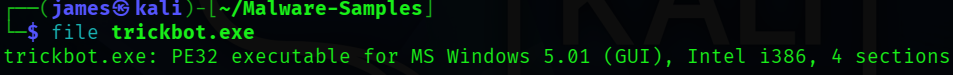
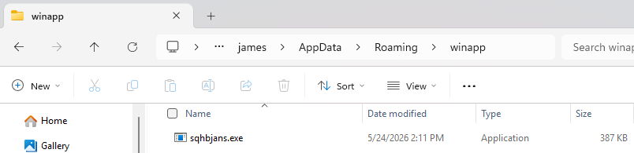

# 🧬 Static Malware Analysis

---

## 📖 Overview

This document explains the static malware analysis process performed inside the Enterprise Threat Hunting Platform.

Static malware analysis investigates malicious files without executing them. The goal is to identify suspicious behavior, malware capabilities, embedded indicators, persistence mechanisms, network activity, and attacker techniques safely and efficiently.

The environment uses:

- VMware Workstation Pro
- Windows 11 Enterprise
- Splunk Enterprise
- Sysmon
- PEStudio
- Detect It Easy (DIE)
- YARA
- VirusTotal
- MalwareBazaar
- PowerShell
- MITRE ATT&CK

to simulate real-world enterprise malware analysis and SOC investigation workflows.

---

## 🎯 Static Analysis Goals

---

The static malware analysis workflow focuses on:

- Identifying suspicious binaries
- Extracting malware indicators
- Detecting persistence behavior
- Identifying embedded strings
- Detecting packers and obfuscation
- Mapping malware behavior to MITRE ATT&CK
- Validating YARA signatures
- Supporting SOC investigations
- Detecting LOLBins usage
- Identifying command-and-control indicators

---

## 🏗️ Static Analysis Architecture

---

### 🖼️ Static Malware Analysis Architecture


**Figure 1:** Enterprise static malware analysis architecture showing malware sample acquisition, PE analysis, YARA scanning, string extraction, VirusTotal intelligence correlation, SIEM integration, and SOC investigation workflows.


---

### 🖼️ Enterprise Threat Hunting Architecture


**Figure 2:** Enterprise VMware Host-Only Threat Hunting Lab architecture showing Windows 11 telemetry collection, Splunk Enterprise SIEM, Suricata IDS monitoring, and SOC investigation workflows.

---

### 🖼️ TrickBot Malware Execution Flow


**Figure 3:** TrickBot malware execution workflow showing malware lifecycle stages, telemetry collection, and SOC detection workflows.

---

## 🖥️ Malware Analysis Environment

---

## 📖 Overview

The malware analysis environment uses VMware Host-Only networking to isolate suspicious malware samples from the public internet.

---

## 🔒 Security Benefits

---

- Prevents malware propagation
- Blocks internet exposure
- Protects analyst systems
- Supports safe malware research
- Enables isolated SOC investigations

---

## 🌐 Network Configuration

---

| Component | IP Address |
|---|---|
| Windows 11 Enterprise | 192.168.159.130 |
| RHEL Splunk Server | 192.168.159.129 |
| Kali Linux Analyst VM | 192.168.159.131 |
| Gateway / DNS | 192.168.159.2 |

---

## 🧬 Malware Sample Overview

---

## 📖 Overview

The malware sample analyzed during the investigation was a suspicious TrickBot executable used for enterprise threat hunting validation.

---

### 🖼️ TrickBot Malware Sample


**Figure 4:** TrickBot malware sample analyzed inside the isolated Windows 11 Enterprise malware analysis environment.

---

## 🔍 File Hash Analysis

---

## 📖 Overview

Hash analysis identifies malware fingerprints and validates threat intelligence reputation.

---

## 📋 Hashing Algorithms

---

| Algorithm | Purpose |
|---|---|
| MD5 | Legacy malware identification |
| SHA1 | Threat intelligence matching |
| SHA256 | Modern malware fingerprinting |

---

## ⚡ Generate File Hash

---

### Command Overview

### Command

```powershell
Get-FileHash .\sqhbjans.exe -Algorithm SHA256
```

---

### Explanation

- `Get-FileHash`: Generates file hashes.
- `.\sqhbjans.exe`: Malware sample.
- `-Algorithm SHA256`: Uses SHA256 hashing.

---

### Summary

This generates the SHA256 hash of the malware sample for threat intelligence analysis.

---

## ☁️ MalwareBazaar Intelligence Analysis

---

## 📖 Overview

MalwareBazaar provides malware intelligence, file reputation analysis, malware family classification, and threat intelligence correlation.

---

### 🖼️ MalwareBazaar Threat Intelligence


**Figure 5:** MalwareBazaar threat intelligence analysis showing TrickBot malware classification, detection signatures, file hashes, and malware metadata.

---

## 🌐 VirusTotal Intelligence Analysis

---

## 📖 Overview

VirusTotal validates malware reputation and identifies known threat intelligence indicators.

---

## 🔍 Analysis Capabilities

---

- Antivirus detections
- Reputation analysis
- Network indicators
- Suspicious domains
- Malware family classification
- Threat intelligence matching

---

### 🖼️ VirusTotal Threat Intelligence


**Figure 6:** VirusTotal malware intelligence analysis showing antivirus detections, suspicious indicators, and threat intelligence reputation associated with the TrickBot malware sample.


---

## ⚡ Example Threat Intelligence Workflow

---

1. Generate malware hash
2. Upload hash to VirusTotal
3. Review antivirus detections
4. Investigate suspicious domains
5. Correlate MITRE ATT&CK techniques
6. Document indicators of compromise

---

## 🧪 PEStudio Static Analysis

---

## 📖 Overview

PEStudio analyzes Windows Portable Executable (PE) files without executing malware.

---

## 🔍 Analysis Capabilities

---

- PE Header Analysis
- Suspicious Imports
- Embedded Strings
- DLL Dependencies
- Malware Indicators
- Entropy Analysis
- Packer Detection

---

## 📦 Common Suspicious Indicators

---

| Indicator | Description |
|---|---|
| High Entropy | Possible packed malware |
| Suspicious Imports | Malware functionality |
| Embedded URLs | Command-and-control indicators |
| PowerShell References | Script execution abuse |
| Registry APIs | Persistence activity |

---

## 🧠 Detect It Easy (DIE) Analysis

---

## 📖 Overview

Detect It Easy (DIE) identifies malware packers, obfuscation methods, and binary signatures.

---

## 🔍 Detection Capabilities

---

- Packer Detection
- Binary Signatures
- Compiler Identification
- Entropy Analysis
- Obfuscation Detection

---

## 🖼️ Windows PE Executable Analysis



**Figure 7:** Static malware analysis identifying the TrickBot sample as a 32-bit Windows Portable Executable (PE32) binary.


---

## 🧾 Embedded Strings Analysis

---

## 📖 Overview

String analysis identifies suspicious commands, URLs, registry paths, and malware artifacts.

---

## 🔍 Common Indicators

---

- PowerShell commands
- Encoded strings
- Registry paths
- URLs and domains
- IP addresses
- LOLBins references

---

## ⚡ Extract Embedded Strings

---

### Command Overview

### Command

```bash
strings sqhbjans.exe
```

---

### Explanation

- `strings`: Extracts readable strings.
- `sqhbjans.exe`: Malware sample.

---

### Summary

This extracts embedded strings from the malware sample for investigation.

---

## 🛡️ YARA Malware Detection

---

## 📖 Overview

YARA rules are used to identify malware artifacts, suspicious strings, and malicious binaries.

---

### 🖼️ TrickBot YARA Rule


**Figure 8:** YARA detection rule used to identify TrickBot malware artifacts and suspicious indicators.

---

## ⚡ Example YARA Scan

---

### Command Overview

### Command

```bash
yara trickbot.yar sqhbjans.exe
```

---

### Explanation

- `yara`: YARA scanning engine.
- `trickbot.yar`: YARA detection rule.
- `sqhbjans.exe`: Malware sample.

---

### Summary

This scans the malware sample using YARA detection signatures.

---

## 🔥 LOLBins Static Analysis

---

## 📖 Overview

Static analysis identifies Living Off the Land Binaries (LOLBins) commonly abused by attackers.

---

## 📋 Common LOLBins

---

| LOLBin | Purpose |
|---|---|
| powershell.exe | Script execution |
| certutil.exe | File download abuse |
| mshta.exe | HTA execution |
| rundll32.exe | DLL execution |
| regsvr32.exe | Script execution |

---

## 🎯 MITRE ATT&CK Mapping

---

## 📖 Overview

MITRE ATT&CK mapping correlates malware capabilities with attacker techniques and SOC detections.

---

## 🔍 Example ATT&CK Techniques

---

| Technique ID | Technique |
|---|---|
| T1059.001 | PowerShell |
| T1218 | Signed Binary Proxy Execution |
| T1547.001 | Registry Run Keys |
| T1105 | Ingress Tool Transfer |
| T1055 | Process Injection |

---

## 📊 Static Analysis Workflow

---

```text
Malware Sample
        ↓
Hash Analysis
        ↓
PE Header Analysis
        ↓
String Extraction
        ↓
Packer Detection
        ↓
YARA Scanning
        ↓
MITRE ATT&CK Mapping
        ↓
Threat Intelligence Correlation
        ↓
SOC Investigation
```

---

## 📊 Splunk Detection Validation

---

### 🖼️ Enterprise Threat Hunting Dashboard 01


**Figure 9:** Splunk Enterprise dashboard displaying authentication monitoring, process activity, and enterprise threat hunting telemetry.

---

### 🖼️ Enterprise Threat Hunting Dashboard 02


**Figure 10:** Advanced Splunk dashboard showing MITRE ATT&CK mapping, threat detections, and SOC investigation workflows.

---

## 🧠 Malware Capability Assessment

---

## 📖 Overview

The malware sample demonstrated characteristics commonly associated with enterprise malware and banking trojans.

---

## 🔍 Observed Indicators

---

- Suspicious executable behavior
- Possible persistence mechanisms
- Encoded PowerShell references
- Embedded network indicators
- LOLBins abuse
- Registry modification capabilities
- Potential C2 communication behavior

---

### 🖼️ Malware Persistence File Location



**Figure 11:** Suspicious malware executable discovered inside the Windows roaming profile directory commonly associated with malware persistence activity.

---

## 🚨 Threat Hunting Workflow

---

## 📖 Overview

Threat hunting workflows validate malware indicators using Splunk Enterprise and Sysmon telemetry.

---

## 🔍 Investigation Process

---

1. Generate malware hashes
2. Perform PE analysis
3. Extract embedded strings
4. Scan using YARA rules
5. Review VirusTotal detections
6. Correlate MITRE ATT&CK techniques
7. Validate SIEM detections
8. Investigate suspicious indicators
9. Document findings
10. Escalate suspicious activity

---

## 🛠️ Static Analysis Best Practices

---

## ✅ Recommended Practices

- Never execute unknown malware directly
- Use isolated VMware environments
- Generate hashes before analysis
- Use multiple threat intelligence sources
- Validate YARA detections
- Review suspicious imports carefully
- Investigate embedded strings
- Correlate MITRE ATT&CK techniques
- Store malware hashes instead of binaries
- Document all findings

---

## 🔐 Security Recommendations

---

### 🚫 Never Upload

- Live malware samples
- Credentials
- API keys
- Private keys
- Sensitive enterprise logs

---

### ✅ Safe Uploads

- Sanitized screenshots
- Redacted logs
- YARA rules
- Detection queries
- Architecture diagrams
- Threat hunting reports
- Malware hashes

---

## 📚 References

---

## 📊 Splunk Enterprise

https://docs.splunk.com/Documentation/Splunk

---

## 🖥️ Sysmon

https://learn.microsoft.com/en-us/sysinternals/downloads/sysmon

---

## 🎯 MITRE ATT&CK

https://attack.mitre.org/

---

## 🧾 YARA

https://yara.readthedocs.io/

---

## 📊 VirusTotal

https://docs.virustotal.com/

---

## ☁️ MalwareBazaar

https://bazaar.abuse.ch/

---

## 📦 PEStudio

https://www.winitor.com/

---

## 🧪 Detect It Easy (DIE)

https://github.com/horsicq/Detect-It-Easy

---

## 🔥 LOLBAS Project

https://lolbas-project.github.io/

---

## 👨‍💻 Author

James Banday

- LinkedIn: https://www.linkedin.com/in/james-allen-morta-banday-62a391128/
- GitHub: https://github.com/jbanday808/Enterprise-Threat-Hunting/tree/main
---

## 📄 License

This project is intended for educational, cybersecurity research, and threat hunting training purposes only.

---
