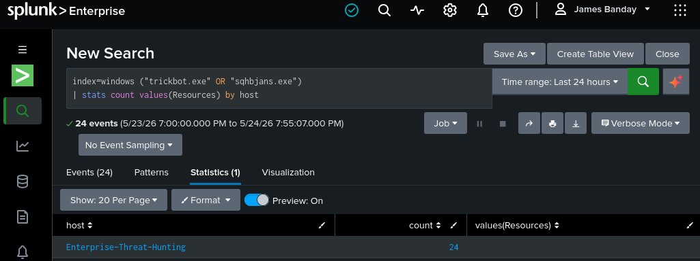

# 🎯 Threat Hunting Report

---

# 📖 Executive Summary

---

## 📌 Threat Hunting Overview

Threat Hunting ID: TH-2026-001

Threat Hunting Type: Enterprise Malware Investigation

Threat Family: TrickBot

Threat Severity: High

Investigation Status: Completed

Investigation Environment:

- VMware Workstation Pro
- Windows 11 Enterprise
- RHEL 10.2
- Splunk Enterprise
- Sysmon
- Splunk Universal Forwarder
- Microsoft Defender
- Suricata IDS
- Kali Linux
- MalwareBazaar
- VirusTotal
- MITRE ATT&CK
- YARA

Threat Hunting Objective:

Identify, analyze, validate, contain, and investigate TrickBot malware activity using enterprise SIEM monitoring, endpoint telemetry collection, malware intelligence correlation, and advanced threat hunting techniques.

---

# 🏗️ Enterprise Threat Hunting Architecture

---

## 🖼️ Enterprise Threat Hunting Architecture


**Figure 1:** Enterprise VMware Host-Only Threat Hunting Lab architecture showing endpoint telemetry collection, Splunk SIEM monitoring, malware analysis workflows, and SOC investigation processes.


---

## 🖼️ TrickBot Malware Execution Flow Architecture


**Figure 2:** TrickBot malware execution workflow showing malware execution stages, persistence mechanisms, endpoint telemetry collection, and enterprise threat hunting visibility.

---

# 🎯 Threat Hunting Process

---

# ⚙️ 1. Setting the Stage

---

## 📖 Overview

The initial phase focused on preparing the enterprise threat hunting environment and configuring security visibility across all systems.

The preparation phase included:

- Deploying Splunk Enterprise SIEM
- Installing Sysmon telemetry monitoring
- Configuring Splunk Universal Forwarder
- Creating isolated VMware environments
- Validating malware analysis workflows
- Preparing enterprise dashboards
- Reviewing TrickBot malware intelligence

---

## ✅ Preparation Activities

- Enabled advanced endpoint telemetry
- Configured Windows Event Log monitoring
- Validated Splunk log ingestion
- Enabled enterprise threat intelligence
- Prepared malware analysis environment
- Configured secure host-only networking
- Enabled enterprise threat hunting dashboards

---

# 🧠 2. Formulating Hypotheses

---

## 📖 Overview

Threat hunting hypotheses were created using:

- MalwareBazaar intelligence
- VirusTotal detections
- Microsoft Defender alerts
- Sysmon telemetry
- Threat actor behavior analysis
- MITRE ATT&CK techniques

---

## 🔍 Example Threat Hunting Hypotheses

- TrickBot malware may establish persistence through registry modifications
- Malware may generate suspicious PowerShell execution
- Malware may create outbound command-and-control connections
- Malware may create suspicious executable files inside roaming directories
- Malware may abuse LOLBins for execution and persistence

---

# 🔍 3. Designing the Hunt

---

## 📖 Overview

The threat hunting strategy focused on analyzing:

- Sysmon Event Logs
- Windows Security Logs
- Splunk SIEM dashboards
- Microsoft Defender detections
- Malware intelligence platforms
- Network traffic activity
- Endpoint process creation telemetry

---

## ✅ Data Sources

| Data Source | Purpose |
|---|---|
| Sysmon | Endpoint telemetry monitoring |
| Splunk Enterprise | SIEM threat detection |
| Windows Defender | Malware detection |
| VirusTotal | Malware intelligence |
| MalwareBazaar | Malware sample validation |
| Suricata IDS | Network monitoring |
| PowerShell Logs | Suspicious command monitoring |

---

# 📡 4. Data Gathering and Examination

---

## 📖 Overview

Security telemetry and malware intelligence were collected and analyzed to identify suspicious TrickBot malware activity.

The investigation focused on:

- Process execution
- File creation activity
- Malware detections
- Network communications
- Registry persistence
- Suspicious executable paths
- Threat intelligence correlation

---

## 🖼️ Splunk Malware Detection Dashboard



**Figure 3:** Splunk Enterprise SIEM dashboard identifying suspicious malware activity, malicious executable paths, and Microsoft Defender malware detections.


---

# ⚡ Threat Hunting Queries

---

## 🔍 Malware Detection Query

```spl
index=*
("sqhbjans.exe" OR "trickbot.exe" OR "Dynamer!rfn")
| rex field=_raw "Threat Name\\s(?<ThreatName>[^<]+)"
| rex field=_raw "Path\\sfile:(?<MalwarePath>[^<]+)"
| stats count by host ThreatName MalwarePath source
```

---

## 🔍 Process Creation Investigation

```spl
index=sysmon EventCode=1
| table _time host Image ParentImage CommandLine User
| sort -_time
```

---

## 🔍 Registry Persistence Investigation

```spl
index=sysmon EventCode=13
| table _time host TargetObject Details Image
```

---

## 🔍 Network Connection Investigation

```spl
index=sysmon EventCode=3
| table _time host Image DestinationIp DestinationPort
```

---

## 🔍 PowerShell Investigation

```spl
index=sysmon powershell.exe "*EncodedCommand*"
| table _time host CommandLine User
```

---

# 🧪 Malware Analysis

---

# 🦠 TrickBot Malware Sample Analysis

---

## 📖 Overview

The TrickBot malware sample was collected from MalwareBazaar and analyzed inside an isolated VMware Host-Only enterprise threat hunting environment.

The malware investigation focused on:

- Malware reputation analysis
- PE executable validation
- Threat intelligence correlation
- Sysmon telemetry collection
- Splunk malware detections
- Endpoint behavioral analysis

---

## 🖼️ MalwareBazaar Threat Intelligence


**Figure 4:** MalwareBazaar intelligence analysis identifying the TrickBot malware family, malware hashes, and known threat intelligence indicators associated with the sample.

---

## 🖼️ VirusTotal Threat Intelligence


**Figure 5:** VirusTotal malware intelligence analysis showing antivirus detections, suspicious indicators, and malware reputation associated with the TrickBot malware sample.

---

## 🖼️ Windows PE Executable Analysis


**Figure 6:** Static malware analysis identifying the TrickBot sample as a 32-bit Windows Portable Executable (PE32) binary.

---

## 🖼️ Suspicious Malware File Location


**Figure 7:** Suspicious TrickBot malware executable discovered inside the Windows roaming application directory during dynamic malware execution analysis.

---

# 🔍 Malware Indicators of Compromise (IOCs)

---

| IOC Type | Indicator |
|---|---|
| Malware Family | TrickBot |
| Executable Name | sqhbjans.exe |
| Malware Type | PE32 Executable |
| Detection Name | Trojan:Win32/Dynamer!rfn |
| Detection Source | Microsoft Defender |
| Malware Intelligence | MalwareBazaar |
| Reputation Analysis | VirusTotal |

---

# 📊 5. Evaluating Findings and Testing Hypotheses

---

## 📖 Overview

The threat hunting investigation confirmed multiple suspicious behaviors associated with TrickBot malware execution and persistence.

---

## ✅ Confirmed Findings

- TrickBot malware executed successfully
- Suspicious executable activity identified
- Microsoft Defender generated malware alerts
- Sysmon telemetry captured process activity
- Splunk Enterprise detected malware indicators
- Malware intelligence platforms confirmed malware reputation
- Suspicious roaming directory artifacts identified

---

## ✅ Confirmed Threat Activity

| Activity | Result |
|---|---|
| Malware Execution | Confirmed |
| Defender Detection | Confirmed |
| Sysmon Telemetry | Confirmed |
| Splunk SIEM Detection | Confirmed |
| Threat Intelligence Match | Confirmed |
| Suspicious Executable Creation | Confirmed |

---

# 🚨 6. Mitigating Threats

---

## 📖 Overview

Containment and remediation actions were performed after validating TrickBot malware activity.

---

## ✅ Containment Actions

- Isolated malware execution environment
- Preserved forensic evidence
- Removed malicious executable
- Restored VMware clean snapshot
- Validated endpoint remediation
- Verified Microsoft Defender protection
- Confirmed malware cleanup

---

# 📚 7. After the Hunt

---

## 📖 Overview

Threat hunting findings, detection methodologies, and investigation results were documented to improve future SOC operations.

---

## ✅ Improvements Implemented

- Improved Sysmon visibility
- Expanded Splunk detection rules
- Improved threat intelligence workflows
- Added malware detection dashboards
- Improved PowerShell monitoring
- Enhanced enterprise threat hunting visibility

---

# 🔄 8. Continuous Learning and Enhancement

---

## 📖 Overview

Threat hunting is an ongoing process requiring continuous detection tuning, investigation refinement, and security visibility improvements.

---

## ✅ Future Enhancements

- Add SOAR automation
- Expand Sigma detections
- Improve AI-assisted alert triage
- Add Kubernetes threat hunting
- Improve automated incident response
- Expand cloud-native threat detection

---

# 🎯 MITRE ATT&CK Mapping

---

| Technique ID | Technique |
|---|---|
| T1059.001 | PowerShell |
| T1547.001 | Registry Run Keys |
| T1105 | Ingress Tool Transfer |
| T1218 | Signed Binary Proxy Execution |
| T1055 | Process Injection |

---

# 📊 Threat Hunting Timeline

---

| Time | Activity |
|---|---|
| 2:11 PM | TrickBot malware executed |
| 2:12 PM | Sysmon process telemetry generated |
| 2:13 PM | Microsoft Defender alert triggered |
| 2:14 PM | Splunk Enterprise detection triggered |
| 2:15 PM | Threat hunting investigation started |
| 2:18 PM | Threat intelligence validated |
| 2:20 PM | Malware isolated |
| 2:25 PM | VMware snapshot restored |

---

# 🛡️ Key Lessons Learned

---

## ✅ Security Findings

- Sysmon significantly improved endpoint visibility
- Splunk Enterprise successfully detected malware activity
- Threat intelligence accelerated malware validation
- VMware Host-Only networking safely isolated malware execution
- MITRE ATT&CK improved detection mapping
- Enterprise dashboards improved SOC investigation workflows

---

# 📚 References

---

## 🧠 Hack The Box Academy

Hack The Box Academy:  
https://academy.hackthebox.com/app/module/214/section/2295

Purpose:

Used for cybersecurity training, threat hunting methodologies, malware investigation workflows, detection engineering techniques, and SOC analyst skill development.

---

## 📊 Splunk Enterprise

https://docs.splunk.com/Documentation/Splunk

Purpose:

Used for enterprise SIEM monitoring, malware detection, and threat hunting.

---

## 🖥️ Sysmon

https://learn.microsoft.com/en-us/sysinternals/downloads/sysmon

Purpose:

Used for advanced endpoint telemetry and malware monitoring.

---

## 🎯 MITRE ATT&CK

https://attack.mitre.org/

Purpose:

Used to map attacker tactics and malware behaviors.

---

## ☁️ MalwareBazaar

https://bazaar.abuse.ch/

Purpose:

Used to download and validate malware samples.

---

## 📊 VirusTotal

https://docs.virustotal.com/

Purpose:

Used for malware reputation analysis and antivirus detections.

---

## 🧾 YARA

https://yara.readthedocs.io/

Purpose:

Used for malware signature creation and threat detection.

---

## 🛡️ Suricata

https://docs.suricata.io/

Purpose:

Used for IDS/IPS network threat detection.

---

# 👨‍💻 Author

James Banday

- LinkedIn: https://www.linkedin.com/in/james-allen-morta-banday-62a391128/
- GitHub: https://github.com/jbanday808/Enterprise-Threat-Hunting/tree/main

---

# 📄 License

This project is intended for educational, cybersecurity research, and enterprise threat hunting training purposes only.

---
